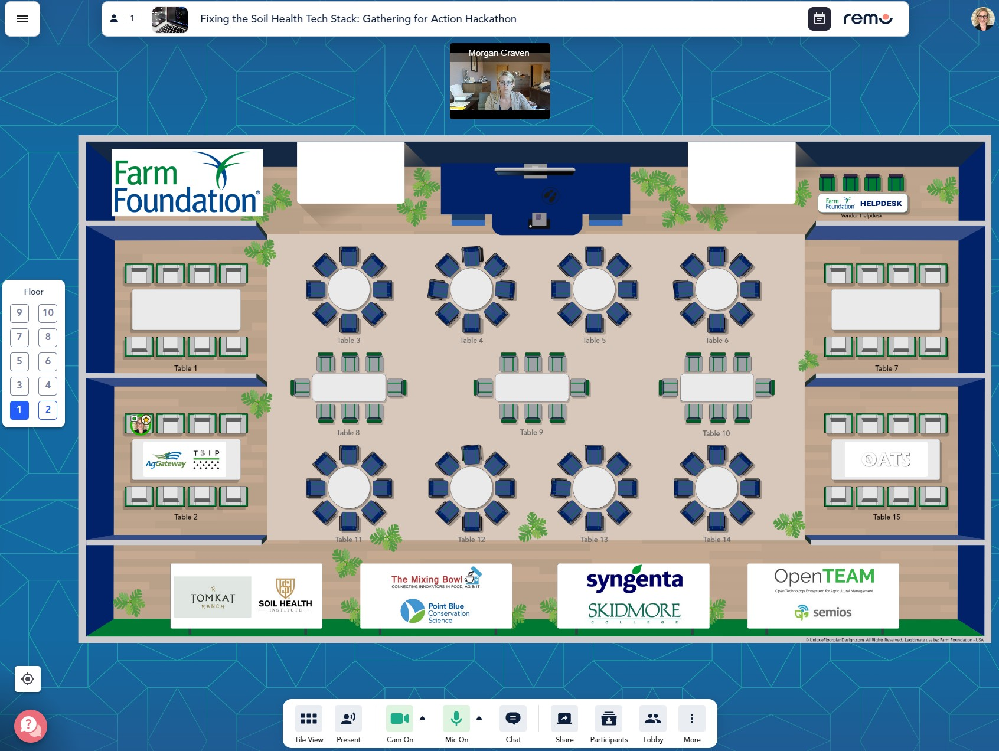

# Fixing the Soil Health Tech Stack - 2022 Hackathon
-----------------------------------------------------

1. [Overview](#overview)  
1. [Hackathon Logistics](#hackathon-logistics)
    1. [Teams](#teams)
    2. [Final Demo](#final-demo)
    3. [Day-Of](#day-of)
3. [Access to Soils Data](#access-to-soils-data)
4. [Technical Pre-Work](#technical-pre-work)
    1. [Modus XML Schema and Nomenclature Lists](#modus-xml-schema-and-nomenclature-lists)
    2. [New JSON-schema version of Modus](#new-json-schema-version-of-modus)
    3. [Universal and Command-line Javascript Tools](#universal-and-command-line-javascript-tools)

# Overview
----------
The goal of this hackathon is to help "fix the soil health tech stack" by writing code together that both produces and uses soils data, thereby demonstrating interoperability and improving toolsets available to the digital soil community specifically around soil sample results and related information.

This is different than a normal hackathon where teams compete to out-do one another in particular challenges.  This hackathon is about shared engineering collaboration: we are all working together toward the final demo, and the more that works the better it is for all of us.

# Hackathon Logistics
---------------------

The Fixing the Soil Health Tech Stack hackathon will start at 9:00 am Central Time on August 23 and conclude with final demos the next day starting at 12:35 pm Central Time on August 24.

## Teams
Participants can decide which teams should form in order to achieve the shared goal. In the leadup to the hackathon, we will use the "fixingsoil" Slack organization to decide on teams and shared final demo goals so that heading into the hackathon we will have a clear runway to getting things working.  All registered participants for the hackathon will receive an invite to the slack team.

Once at least a first draft of available teams has been decided, we will update this page with the teams list and proposed final demos.

## Day-Of
The hackathon will take place in the virtual events platform [Remo.co](https://remo.co).  The main "virtual floor" is a set of tables that participants can move freely between as they have discussions.  We intend that each team will have a dedicated table, and any participants can move between teams to collaborate or ask questions.  It is also easy to have ad-hoc small discussions by just having a few people pop over to an unoccupied table.  The "virtual floor" for this hackathon will look like this:

**Each team will elect a "speaker" who will be in charge of handling communicating the teams progress during the hackathon and presenting their part of the final demo.  A team may have more than one person speak at the final demo, but one person should be in charge of communication of this sort.

## Final Demo
-------------
The goal of the final demo is demonstrating interoperability between tools regarding soils data.  The tools, libraries, apps, etc. developed at this hackathon will likely fall into one of these categories:

1. **Form**: Models of soil sampling data
2. **Backfill**: Populating the standardized models with past data of various forms, or exporting the standardized forms back into CSV and other formats.
3. **Function**: Apps and Analysis that can consume soil samples in the standardized models and show them in a UI or chart.

# Access to Soils Data
-----------------------
We hope to have API access to all the soil samples we have collected prior to this event for participants to use.  Defining this API, however, can and likely will be part of the ongoing work during the hackathon.  We will therefore provide instructions on how to access an initial simple API structure to retreive soil samples, but may add to that structure during the hackathon.

# Technical pre-work
---------------------
We have chosen the **Modus** format hosted by Ag Gateway as the main soil sampling result model for this hackathon.  We've made a JSON schema which faithfully represents the original Modus XML spec, a converter for XML into that JSON schema.  We hope to also develop, either prior to or at the hackathon, a "slim" version that is simple to navigate.

### Modus XML Schema and Nomenclature Lists 
These can be found at the Modus Bitbucket repo here: https://bitbucket.org/modus/modus-schema/src/Version-1.0/.

### New JSON-schema version of Modus
There are three components of the JSON version of Modus (to mirror the original XML structure): `global`, `modus-submit`, and `modus-result`.  `modus-result` uses definitions found in `global` and is the form in which a soils lab would communicate lab results.  Hence it will be the focus of this hackathon.

These three components are published as JSON schemas (compiled from Typescript), and associated Typescript types.  
1. `global`
Source (TS):  https://github.com/OADA/formats/blob/master/schemas/modus/v1/global.schema.cts 
JSON Schema: https://formats.openag.io/modus/v1/global.schema.json
Typescript Types (npm): `@oada/types/modus/v1/global'

2. `modus-result`
Source (TS):  https://github.com/OADA/formats/blob/master/schemas/modus/v1/modus-result.schema.cts 
JSON Schema: https://formats.openag.io/modus/v1/modus-result.schema.json
Typescript Types (npm): `@oada/types/modus/v1/modus-result'

### Universal and Command-line Javascript Tools
A monorepo of tooling is avaiable here: https://github.com/oats-center/modus.  
1. `examples`: @modusjs/examples.  Directly import-able XML and json examples of modus (great for testing).
2. `convert`: @modusjs/convert.  Javascript library to convert between formats.  Currently supports converting a Modus XML string into Modus JSON.
3. `cli`: @modusjs/cli.  Command-line tool to perform file conversions (i.e. xml to json).

## Thank you
Thanks to all who have elected to participate in this hackathon and we look forward to the great thing we can do together to "Fix the Soil Health Tech Stack!"

